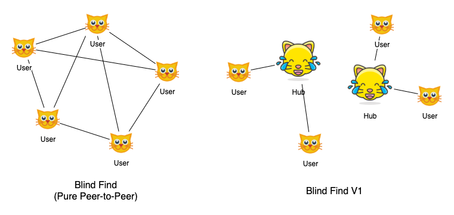
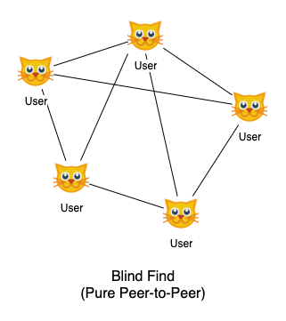

# Blind Find v1 Specification

*Blind Find* is a peer-to-peer network allowing private peer search proposed by Barry Whitehat and Kobi Gurkan. For the detail specification, please read the [post][blind-find-ethresearch] on ethresearch.

Here, we only specify how the first version of Blind Find (**Blind Find v1**) works.

## Introduction

The ultimate version of [Blind Find][blind-find-ethresearch] has a pure peer-to-peer design: every user is not only a server handling search requests but also a client that can send requests. **Blind Find v1** is simplified and more centralized, which is easier to be built as a proof of concept.

Unlike the ultimate version, Blind Find v1 is hierarchical. We have three roles in the network: [Blind Find Admin](#Blind-Find-Admin), [Hub](#Hub), and [User](#User). Hubs are permissioned by the admin (Blind Find Admin) through registration. Users only interact with registered hubs.

## Hub

A hub is essentially a [super node](https://en.wikipedia.org/wiki/Supernode_(networking)) which can serve multiple user requests simultaneously.

### Registered as a hub

There can be multiple hubs. For one to be registered as a hub, one must sign on a message `REGISTER_NEW_HUB = hash("REGISTER_NEW_HUB" ++ adminEthereumAddress)` and send it along with the public key to the [admin](#Blind-Find-Admin). The hub's signature is commited as a leaf node in an append-only sparse merkle tree. The root of the merkle tree is commited on Blind Find v1 contract. This commitment allows a hub to generate a zero-knowledge proof that it is indeed a registered hub without leaking which one.

## Blind Find Admin

The administrator of the Blind Find v1 contract. It should update the merkle root stored on the contract whenever a new hub is registered to make the hub becomes valid.

## User

A user can join a [hub](#Hub) to make itself searchable by other users. It can also search if another user has joined a hub by sending a request to the hub.

### Join a hub

`joinHub(userPubkey: PublicKey, userSig: Signature, hubPubkey: PublicKey)`

To join a hub, a user is required to sign a `joinMsg = hash(userPubkey ++ hubPubkey)` with their private key and hand the signature `userSig` with the corresponding `userPubkey` to the hub. The signature is to avoid hubs from arbitrarily adding a user without the user's authentication. Then, the hub also countersigns on the `joinMsg` and add it to its own database. These information is only stored by the hub privately.

#### Search for user

`searchForUser(hub: TCPIPAddress, target_user: PublicKey)`

A user can ask a hub if it can reach another user *target user* through the hub. The search does not reveal the *target user* whom the user is searching for. Also, `hub` does not learn 1) if the search succeeds or not 2) who initiated the search (though the hub learns the initiator's TCP/IP address).

To avoid the hub learning whom the user is looking for, [SMP][smp] is used to compare user identities, i.e. public ids. Only the user can learn whether *target user* is found.

After successfully finding the *target user* through a hub, the user can generate a [Proof of Indirect Connection][proof-of-indirect-connection-v1] to prove that it can reach the target peer through *some* hub, without leaking the hub's identity.

## Future Works

By having these roles in Blind Find v1, some problems are made easier:
- Searching for offline users: users can still be searched after going offline because hubs are mostly online and hubs remember its users.
- DoS attack prevention: due to the fact that all searches go through the hubs, we can just put rate limiting on the hubs to avoid DoS attack.

However, decentralization is the trade-off because the admin can censor hubs and also hubs can censor users.

### Blind Find v1.5

In v1, a user can only search for the users who has joined the same hub as the hub it performs `search`. In other words, users are not able to search for others across hubs. In v1.5, we will support cross-hubs searches by connecting hubs with each other and supporting message proxying.

### Blind Find Ultimate

Ultimately, we will make the system pure peer-to-peer again. There will be no Blind Find admin and hubs. By the time, we will revisit how to prevent DoS attack and how to make nodes searchable even after they become offline.

[blind-find-ethresearch]: https://ethresear.ch/t/blind-find-private-social-network-search/6988
[smp]: https://en.wikipedia.org/wiki/Socialist_millionaire_problem#Off-the-Record_Messaging_protocol
