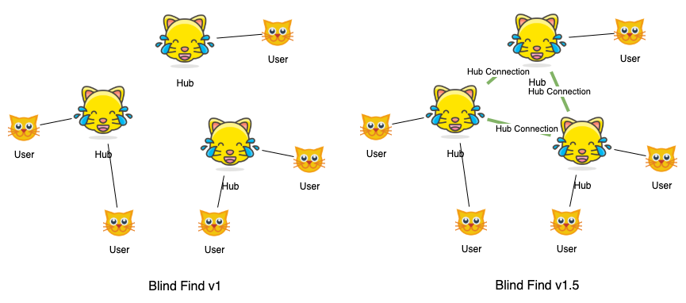
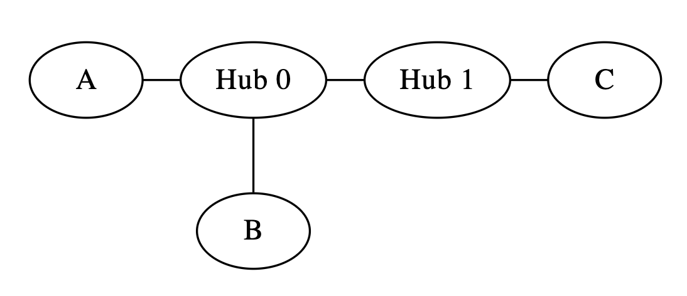
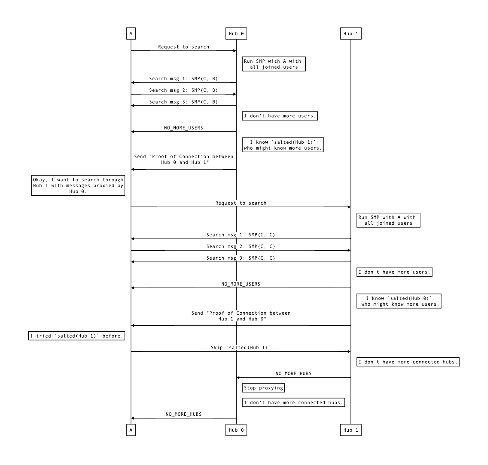

# Blind Find v1.5 Specification

## Main Changes over v1

Cross-hub search is supported.
- Hubs can connect with each other. When a user searches for another user through a hub, the hub can keep searching through other hubs who has connected with itself.
- Proof of Salted Connection
- Proof of Indirect Connection
- Messages proxying in search protocol



## Introduction
We have the admin-hub-user hierarchy. Hubs can connect with each others, which allows users to search for others who joined different hubs while preserving the following  advantages:
- Spam prevention: search messages always go through the hubs. Hubs can stop spamming by setting rate limit for search messages.
- Cache: users can go offline and still able to be searched by others as long as hubs are online.

## Roles
### Hub
A hub is a [super node](https://en.wikipedia.org/wiki/Supernode_(networking)) which can serve multiple user requests simultaneously. Users can
- join a hub to be found by other users.
- search for other users. User A can successfully find user B only in two conditions:
    1. User B has joined the same hub where user A initiates the search.
    2. User B has joined a hub which is either directly connected or indirectly connected with the hub where user A initiates the search.
> Define "indirectly connected": hub A is indirectly connected with hub B if there exists intermediate hubs I1, I2, ..., Ik such that A is connected with I1, I1 is connected I2, ..., and Ik is connected with B.

#### Hub Registry
There can be multiple hubs. To be registered as a hub, one must sign on a message `hash("REGISTER_NEW_HUB" ++ adminEthereumAddress)` and send them along with the public key to the admin. The hub's public key and signature are commited as a leaf node in an append-only sparse merkle tree on chain. This commitment allows a hub to generate a zero-knowledge proof that it is indeed a registered hub without leaking which one.

#### Hub Connection
For a hub to connect another hub, both of them need to sign on a message `hash("HUB_CONNECTION" ++ pubkeyHub1 ++ pubkeyHub2)`. To be authorized by the admin, admin hashes the signatures and public keys altogether and puts the result as a leaf of hub connection merkle tree. The new merkle root should be updated on chain to make the hub connection valid. This allows either of the hubs to create a [Proof of Salted Connection](#Proof-of-Salted-Connection), which proves they are connected.

### Admin
Admin authorizes new hubs and new hub connections. All hub registries are stored in a hub registry merkle tree and all hub connections are stored in a hub connection merkle tree. The roots of both trees are commited by storing their merkle roots on Blind Find contract. Whenever a new hub joins the network, admin needs to update the root of the hub registry merkle tree on the contract. Likewise, whenever two hubs connect with each other, admin needs to update the root of the hub connection merkle tree on the contract.

### User
A user can join a [hub](#Hub) to make itself searchable by other users. It can also search if it can find another user through a hub.

#### Join a hub
`joinHub(userPubkey: PublicKey, userSig: Signature, hubPubkey: PublicKey)`

To join a hub, a user is required to sign a `hash(userPubkey ++ hubPubkey)` using their private key and send the signature `userSig` with the corresponding `userPubkey` to the hub. The signature is to avoid hubs from arbitrarily adding a user without their authentication. Then, the hub also countersigns on the `joinMsg` and add it to its own database. These information is only stored inside the hub and is used to generate zero-knowledge proofs.

#### Search for user
`searchForUser(hub: TCPIPAddress, target_user: PublicKey)`

A user search for other users by asking a hub if it can reach a *target user* through the hub. The search does not reveal the *target user* whom the user is searching for. Also, `hub` does not learn 1) if the search succeeds or not 2) who initiated the search (though the hub learns the initiator's TCP/IP address).

To avoid hubs learning whom the user is looking for, [SMP](#SMP) is used to compare user identities, i.e. public ids. Only the user can learn whether *target user* is found.

After successfully finding the *target user* through a hub, the user can generate a [Proof of Indirect Connection][proof-of-indirect-connection-v1] to prove that it can reach the target peer through *some* hub, without leaking the hub's identity.

## SMP

[SMP][smp-wiki] protocol allows two entities to compare if their secrets are the same or not, without revealing other information.

We modified the ECC based SMP protocol from [OTR v4][otr-spec-v4] for performance purpose. Baby Jubjub and Poseidon hash are used due to their efficiency in zk-SNARK, instead of the original Ed448 with SHAKE-256. The following contents are largely referenced from [maci-crypto](https://github.com/appliedzkp/maci/blob/master/crypto/ts/index.ts) and [baby-jubjub](https://github.com/iden3/circomlib/blob/master/src/babyjub.js#L21).

### Constants
```typescript
// Generator of the subgroup of Baby Jubjub curve points group.
G: babyJub.Base8 = (
    5299619240641551281634865583518297030282874472190772894086521144482721001553,
    16950150798460657717958625567821834550301663161624707787222815936182638968203
);
// Order of the subgroup
q = 21888242871839275222246405745257275088614511777268538073601725287587578984328 >> 3;
```

### Functions
```typescript
// Poseidon hash. It's just an abstraction here. Which exactly we're going to call depends on the number of parameters.
hash(params...): BigInt;
```

### SMP Protocol

Assuming H initiates SMP with A.

#### Step 1: H computes SMP message 1 and send to A.

- Picks random Baby Jubjub values `h2`, `h3`, `r2`, and `r3`.
- Generates `G2h = h2 * G` and `G3h = h3 * G`.
- Computes the proof of knowledge of discrete log based on Schnorr’s protocol for `G2h` and `G3h`. I.e. H knows `h2` s.t. `G2h = h2 * G` without leaking `h2`.
    - 1) `G2hProof`: `c2 = hash(0x01 || r2 * G)` and `d2 = r2 - h2 * c2`.
    - 2) `G3hProof`: `c3 = hash(0x02 || r3 * G)` and `d3 = r3 - h3 * c3`.

##### SMP Message 1
```
* G2h
* G2hProof
* G3h
* G3hProof
```

#### Step 2: A validates SMP message 1 and computes SMP message 2 and send to B.
- Validates SMP Message 1
    - Validates that `G2h` and `G3h` are on the curve baby-jubjub, that they are in the correct group and that they do not degenerate.
    - Validates `G2h` matches `G2hProof` and `G3h` matches `G3hProof`.
- Picks random Baby Jubjub values `a2`, `a3`, `r2`, `r3`, `r4`, `r5`, and `r6`.
- Computes `G2a = a2 * G` and `G3a = a3 * G`.
- Computes the proof of knowledge of discrete log by Schnorr's protocol for `G2a` and `G3a`
    1) `G2aProof`: `c2 = hash(0x03 || r2 * G)` and `d2 = r2 - a2 * c2`.
    2) `G3aProof`: `c3 = hash(0x04 || r3 * G)` and `d3 = r3 - a3 * c3`.
- Computes `G2 = a2 * G2a` and `G3 = a3 * G3a`.
- Computes `Pa = G3 * r4` and `Qa = G * r4 + G2 * (secretA mod q)`.
- Computes `PaQaProof`: `cp = hash(0x05 || G3 * r5 || G * r5 + G2 * r6)` and `d6 = (r6 - (secretA mod q) * cp) mod (q)`.
    - `PaQaProof` is a proof of equality of discrete coordinates based on Boudot, Schoenmakers and Traoré’s extension to a protocol by Chaum and Pedersen.
    - It proves that given `G`, `G2`, `G3`, `Pa` and `Qa` A knows `r4` and `secretA` s.t. `Pa = G3 * r4` and `Qa = G * r4 + G2 * (secretA mod q)`.

##### SMP Message 2
```
* G2a
* G2aProof
* G3a
* G3aProof
* Pa
* Qa
* PaQaProof
```

#### Step 3: H validates SMP message 2 and computes SMP message 3 and send to B.

- Validates SMP Message 2
    - Validates that `G2a` and `G3a` are on the curve baby-jubjub, that they are in the correct group and that they do not degenerate.
    - Validates `G2h` matches `G2hProof` and `G3h` matches `G3hProof`.
* Computes `G2 = G2a * h2` and `G3 = G3a * h3`.
* Picks random Baby Jubjub values `r4`, `r5`, `r6`, and `r7`.
* Computes `Ph = G3 * r4` and `Qh = G * r4 + G2 * (secretH mod q)`.
* Computes PhQhProof: `cp = hash(0x06 || G3 * r5 || G * r5 + G2 * r6)` and `d6 = (r6 - (secretH mod q) * cp) mod (q)`, where `secretH` is the SMP secret value of H.
* Computes `Rh = (Qh - Qa) * h3`.
* Computes `RhProof`: `cr = hash(0x07 || G * r7 || (Qh - Qa) * r7)` and `d7 = r7 - a3 * cr`.
    * `RhProof` is a Proof of equality of two discrete logs based on the protocol by Chaum and Pedersen.
    * It proves that given `G`, `G3h`, `Rh`, and `Qh - Qa`, H knows `h3` s.t. `G3h = G * h3` and `Rh = (Qh - Qa) * h3`
* Sends A a SMP message 3.

##### SMP Message 3
```
* Ph
* Qh
* PhQhProof
* Rh
* RhProof
```

#### Step 4: A validates SMP message 3 and computes the comparison result.

- Validates SMP Message 3
    - Validates that `Ph`, `Qh`, and `Rh` are on the curve baby-jubjub, that they are in the correct group and that they do not degenerate.
    - Validates `Ph` and `Qh` matches `PhQhProof` and `Rh` matches `RhProof`.
- Computes `Rea = Rh * a3` and checks whether `Rea == Ph - Pa`.

| Step | What H knows | Shared | What A knows |
|-| -------- | -------- | -------- |
|0 | `secretH`, `h2`, `h3`, `r2`, `r3` | `G` | `secretA`, `a2`, `a3`, `r2`, `r3` |
|1| Compute `G2h` and `G3h` | | |
|2| |  | Receive `G2h`, `G3h`|
|| |  | Compute `G2`, `G3`, `Pa`, `Qa` and send to H |
|3|Receive `G2a`, `G3a` |  | |
|| Compute `G2`, `G3`, `Ph`, `Qh`, `Rh` and send to A |  | |
|4| |  | Receive `Ph`, `Qh`, `Rh` |
|| |  | Compute `Rea = Rh * a3` |
|| |  | Check `Rea == Ph - Pa` and learn the result |

## Search Protocol
After initiating a search request, a user keeps running SMP with a remote hub to find its target. If all of the hub's users are tried but the target is still not found, the hub then acts as a proxy between the user and one of its connected hub to keep searching. This procedure is repeated until all of the hubs' connected hubs are tried.

### Pseudo Code
Search request receiver
```python
class Hub:
    ...

    def handle_search(self, initiator_socket):
        # Run SMP with the search initiator against our users.
        for user in self.users:
            smp(initiator_socket, user)

        # Tell the search initiator that we don't have more user.
        send_no_more_users(initiator_socket)

        # Try other hubs that have connection with us instead.
        for hub in self.connected_hubs:
            # Send the Proof of Connection with `salted(hub)` to the search initiator.
            proof_connection_with_salted_hub = gen_proof_hub_connection(hub)
            initiator_socket.send(proof_connection_with_salted_hub)
            hub_conn = open(hub)
            # Proxy messages between initiator and hub back and forth.
            proxy(initiator_socket, hub_conn)
            # Wait until NO_MORE_HUBS are sent.
            wait_for_no_more_hubs(hub_conn)

        # Indicate we have no more hubs, and the search on our side is done.
        send_no_more_hubs(initiator)
```

Search request initiator

```python
class User:
    ...

    def search(
        self,
        ip: string,
        port: number,
        target: PubKey,
    ) -> List[ProofIndirectConnection]:
        hub_socket = open(ip, port)
        return self._search(hub_socket, target, [])

    def _search(
        self,
        hub_socket: Socket,
        target: PubKey,
        proof_connections: List[ProofConnection],
    ) -> List[ProofIndirectConnection]:
        hub_socket = open(ip, port)
        cur_res = []

        # Run SMP with all users of the hub.
        while not hub_conn.is_closed:
            control_msg = hub.conn.read()
            if control_msg.type == 'USER':
                smp_detail, proof_smp = run_smp(hub_socket, target)
                if smp_detail.res:
                    proof_successful_smp = self.create_proof_smp(proof_smp)
                    proof_indirect_connection = {
                        'proof_connections': proof_connections,
                        'proof_smp': proof_smp,
                        'proof_successful_smp': proof_successful_smp,
                    }
                    cur_res.append(proof_indirect_connection)
            elif control_msg.type == 'NO_MORE_USERS':
                break
            else:
                raise InvalidControlMsg

        # Keep searching through the connected hubs of the hub with messages proxied.
        while not hub_conn.is_closed:
            control_msg = hub.conn.read()
            if control_msg.type == 'HUB':
                # Verify if Proof of Connection is correct or not
                if not self.verify_proof_connection(control_msg.hub.proof_connection):
                    raise InvalidProof("Proof Connection is invalid")
                # Now messages should already be proxied.
                proofs = self._search(
                    hub_socket,
                    target,
                    proof_connections + control_msg.hub.proof_connection,
                )
                # Concat the search results got from the hub to `cur_res`.
                cur_res.extends(proofs)
            elif control_msg.type == 'NO_MORE_HUBS':
                break
            else:
                raise InvalidControlMsg
        return cur_res
```

### Example
For example, hub 0 is connected with hub1. User A is searching for user C through hub 0.



Interaction Diagram



## Proof Statements

### Proof of SMP
After each run of SMP, a Proof of SMP is created by hub H to prove to user A that:
1) User C has joined a valid hub who has been permissioned by the admin. I.e. hub H has an entry in the hub merkle tree and the signature in the entry is valid.
2) SMP is run correctly on H's side, and the public key of user C is used as H's secret.

```
Private inputs
    # To prove H is a hub, i.e. has an entry in the hub merkle tree on chain.
    registerNewHubMsg: the message for H to sign when registered as a hub.
    merkleEntryH = (pubkeyH, sigH, sigAdmin): This is H's entry in the hub merkle tree. It must include H's signature, its public key, and admin's signature and public key.
    merklePathH: Merkle path to the hash of H's entry in the hub registry tree.

    # Both the hub and the user's authentication on the joining.
    joinMsg: the message for C and H to sign when joining the hub H
    sigJoinMsgC: C's signature on `joinMsg`
    sigJoinMsgH: H's signature on `joinMsg`

    h2, h3, r4: secrets on H's side to compute intermediary values in SMP

Public inputs
    pubkeyC: C's public key in baby-jub
    adminAddress: ethereum address of admin.

    # SMP parameters
    G: generator in baby-jub
    # SMP Message 1
    smpMsg1
    # SMP Message 2
    smpMsg2
    # SMP Message 3
    smpMsg3

    merkleRoot: the merkle root of the hub merkle tree

Constraints
    # 1. H is a hub, i.e. H indeed has an entry in the hub registry merkle tree. Its signature on registerNewHubMsg is valid.
    Verify H's signature: `message = registerNewHubMsg, pubkey = pubkeyH, and signature = merkleEntryH.sigH` match.
    Verify H's merkle proof in the hub merkle tree, with 1) `merkleRoot` 2) `merkleEntryH` 3) `merklePathH`

    # 2. C has joined the hub, i.e. C and the hub have signed on the `joinMsg`
    Verify C's signature: `message = joinMsg, pubkey = pubkeyC, and signature = sigJoinMsgC` match
    Verify H's signature: `message = joinMsg, pubkey = pubkeyH, and signature = sigJoinMsgH` match

    # 3. SMP is run correctly on H’s side, and pubkeyC is the search term.
    # Verify all the proofs in `smpMsg1`, `smpMsg2`, and `smpMsg3`. This way we ensure each msg is well-calculated and the SMP protocol from step 1 to step 3 is enforced.
    Verify smpMsg1: G2h and G3h are valid and the proofs are correct.
    Verify smpMsg2: G2a, G3a, Pa, and Qa are valid and the proofs in smpMsg2(G2aProof, G3aProof, and PaQaProof) are correct.
    Verify smpMsg3: Ph, Qh, and Rh are valid and the proofs are correct.
    Verify that Qh is correctly calculated from pubkeyC.
```

### Proof of Successful SMP
If a SMP run succeeds, user A successfully finds user C. User A then generates a Proof Of Successful SMP to prove
- Secrets of both sides match in SMP, i.e. user C is found.
- SMP is run by user A: only the user who has actually run this SMP can create this proof because it is the only one who knows `a3`. Also, user A signs on the final result of SMP, binding `pubkeyA` with this SMP run.

```
Private inputs
    a3: the random value of A used in SMP
    sigA: signature of A on `Rh`

Public inputs
    Rh: the semi-final result in smpMsg3 sent from H
    Pa: the intermediate P value in smpMsg2 from A
    Ph: the intermediate P value in smpMsg3 from H
    pubkeyA: the public key of A

Constraints
    # Verify SMP matches
    Verify `(Rh * a3) === (Ph - Pa)`.

    # Verify A's signature
    Verify that `sigA` matches `pubkeyA` and `hash(Rh)`.
```

### Proof of Salted Connection
```=
Private Inputs
    hubPubkey0: PubKey
    hubPubkey1: PubKey

    sig0: Signature
    merkleProof0: merkle proof of hub0's hub registry

    hubConnectionSig0: hub0's signature on hubConnectionMsg
    hubConnectionSig1: hub1's signature on hubConnectionMsg
    hubConnectionMerkleProof: merkle proof of the entry of the connection between hub0 and hub1.

Public Inputs
    hubConnectionMsg: string = "HubConnection"
    saltedHubPubkey0: hub0's public key (salted)
    saltedHubPubkey1: hub1's public key (salted)
    merkleRoot: merkle root of the hub registry tree
    hubConnectionMerkleRoot: merkle root of the hub connection merkle tree

Constraints
    # Salted identities
    saltedHubPubkey0 === hash(hubPubkey0)
    saltedHubPubkey1 === hash(hubPubkey1)

    # Hub registry
    verifySignature(hubPubkey1, sig1, registerNewHubMsg)
    verifySignature(hubPubkey2, sig2, registerNewHubMsg)
    verifyMerkleProof(merkleProof1, merkleRoot)
    verifyMerkleProof(merkleProof2, merkleRoot)

    # Hub Connection
    hubConnectionSigningMsg = hubConnectionMsg ++ hubPubkey1 ++ hubPubkey2
    verifySignature(hubPubkey1, hubConnectionSig1, hubConnectionSigningMsg)
    verifySignature(hubPubkey2, hubConnectionSig2, hubConnectionSigningMsg)
    verifyMerkleProof(hubConnectionMerkleProof, hubConnectionMerkleRoot)
```

### Proof of Indirect Connection

Continue with the [example](#Example) above. Assume user A has run SMP with Hub 1 and SMP result is true.

Proof of Indirect Connection is composed of the following proofs:
1. [Proof of SMP](https://github.com/mhchia/blind-find/blob/main/specs/blind_find_v1.md#proof-of-smp) is created by Hub 1.
2. All intermediate [Proof of Salted Connection](#Proof-of-Salted-Connection)s.
    - A Proof of Salted Connection is created by Hub 0 to prove salted(Hub 0) is connected with salted(Hub 1).
3. [Proof of Successful SMP](https://github.com/mhchia/blind-find/blob/main/specs/blind_find_v1.md#proof-of-successful-smp) is created by user A.

### Defects of the current design

If user A sends a Proof of Indirect Connection to the others and the hub H receives the proof somehow, H can identify the SMP messages in the proof and learn that user A has run SMP with hub H itself before. This makes hub H can correlate the public key and underlay address of user A. Currently, SMP messages must be public to correlate Proof Of SMP and Proof of Successful SMP. We can later solve it if we change to a proof system with recursive proof construction.

## Future Works
### Blind Find Ultimate
Ultimately, we will make the system pure peer-to-peer again. There will be no Blind Find admin and hubs. By the time, we will revisit how to prevent DoS attack and how to make nodes searchable even after they become offline.


[blind-find-ethresearch]: https://ethresear.ch/t/blind-find-private-social-network-search/6988
[smp-wiki]: https://en.wikipedia.org/wiki/Socialist_millionaire_problem#Off-the-Record_Messaging_protocol
[smp-paper]: https://www.win.tue.nl/~berry/papers/dam.pdf
[otr-spec-v4]: https://github.com/otrv4/otrv4/blob/master/otrv4.md#socialist-millionaires-protocol-smp
