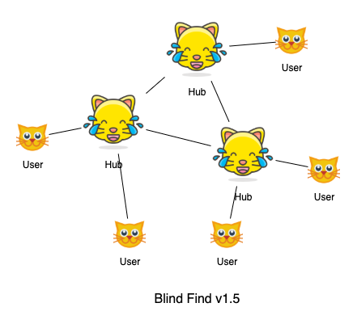

# Blind Find v1 Specification

*Blind Find* is a peer-to-peer network allowing private peer search proposed by Barry Whitehat and Kobi Gurkan. For the detail specification, please read the [post][blind-find-ethresearch] on ethresearch.

Here, we only specify how the first version of Blind Find (**Blind Find v1**) works.

## Introduction

The ultimate version of [Blind Find][blind-find-ethresearch] has a pure peer-to-peer design: every user is not only a server handling search requests but also a client that can send requests. **Blind Find v1** is simplified and more centralized, which is easier to be built as a proof of concept.

Unlike the ultimate version, Blind Find v1 is hierarchical. We have three roles in the network: [Blind Find Admin](#Blind-Find-Admin), [Hub](#Hub), and [User](#User). Hubs are permissioned by the admin (Blind Find Admin) through registration. Users only interact with registered hubs.


## Roles

### Hub

A hub is a [super node](https://en.wikipedia.org/wiki/Supernode_(networking)) which can serve multiple user requests simultaneously. Users can
- Join a hub and then be found by other users.
- Search for other users who has joined the hub before.

#### Registered as a hub

There can be multiple hubs. For one to be registered as a hub, one must sign on a message `hash("REGISTER_NEW_HUB" ++ adminEthereumAddress)` and send them along with the public key to the admin. The hub's signature is commited as a leaf node in an append-only sparse merkle tree. The root of the merkle tree is commited on a contract called Blind Find v1 contract. This commitment allows a hub to generate a zero-knowledge proof that it is indeed a registered hub without leaking which one.

### Blind Find Admin

Blind Find Admin is the admin of Blind Find v1 contract. It is an Ethereum account, which means it can be a usual account or a contract. Whenever a hub requests to registered, admin should
1. Put the commitment of the data signed by the hub in the merkle tree.
2. Update the new merkle root on Blind Find v1 contract to make the hub valid.

### User

A user can join a [hub](#Hub) to make itself searchable by other users. It can also search if another user has joined a hub by sending a request to the hub.

#### Join a hub

`joinHub(userPubkey: PublicKey, userSig: Signature, hubPubkey: PublicKey)`

To join a hub, a user is required to sign a `hash(userPubkey ++ hubPubkey)` using their private key and send the signature `userSig` with the corresponding `userPubkey` to the hub. The signature is to avoid hubs from arbitrarily adding a user without their authentication. Then, the hub also countersigns on the `joinMsg` and add it to its own database. These information is only stored inside the hub and is used to generate zero-knowledge proofs.

#### Search for user

`searchForUser(hub: TCPIPAddress, target_user: PublicKey)`

A user search for other users by asking a hub if it can reach a *target user* through the hub. The search does not reveal the *target user* whom the user is searching for. Also, `hub` does not learn 1) if the search succeeds or not 2) who initiated the search (though the hub learns the initiator's TCP/IP address).

To avoid hubs learning whom the user is looking for, [SMP](#SMP) is used to compare user identities, i.e. public ids. Only the user can learn whether *target user* is found.

After successfully finding the *target user* through a hub, the user can generate a [Proof of Indirect Connection][proof-of-indirect-connection-v1] to prove that it can reach the target peer through *some* hub, without leaking the hub's identity.

## SMP

[SMP][smp-wiki] protocol allows two entities to compare if their secrets are the same or not, without revealing other information.

We modified the ECC based SMP protocol from [OTR v4][otr-spec-v4] for performance purpose. Baby Jubjub and Poseidon hash are used due to their efficiency in zk-SNARK, instead of the original Ed448 with SHAKE-256. The following contents are largely referenced from [maci-crypto](https://github.com/appliedzkp/maci/blob/master/crypto/ts/index.ts) and [baby-jubjub](https://github.com/iden3/circomlib/blob/master/src/babyjub.js#L21).

### Constants
```typescript
// Generator of the subgroup of Baby Jubjub curve points group.
G: babyJub.Base8 = (
    5299619240641551281634865583518297030282874472190772894086521144482721001553,
    16950150798460657717958625567821834550301663161624707787222815936182638968203
);
// Order of the subgroup
q = 21888242871839275222246405745257275088614511777268538073601725287587578984328 >> 8;
```

### Functions
```typescript
// Poseidon hash. It's just an abstraction here. Which exactly we're going to call depends on the number of parameters.
hash(params...): BigInt;
```

### Protocol

Assuming H initiates SMP with A.

#### Step 1: H computes SMP message 1 and send to A.

- Picks random Baby Jubjub values `h2`, `h3`, `r2`, and `r3`.
- Generates `G2h = h2 * G` and `G3h = h3 * G`.
- Computes the proof of knowledge of discrete log based on Schnorr’s protocol for `G2h` and `G3h`. I.e. H knows `h2` s.t. `G2h = h2 * G` without leaking `h2`.
    - 1) `G2hProof`: `c2 = hash(0x01 || r2 * G)` and `d2 = r2 - h2 * c2`.
    - 2) `G3hProof`: `c3 = hash(0x02 || r3 * G)` and `d3 = r3 - h3 * c3`.

##### SMP Message 1
```
* G2h
* G2hProof
* G3h
* G3hProof
```

#### Step 2: A validates SMP message 1 and computes SMP message 2 and send to B.
- Validates SMP Message 1
    - Validates that `G2h` and `G3h` are on the curve baby-jubjub, that they are in the correct group and that they do not degenerate.
    - Validates `G2h` matches `G2hProof` and `G3h` matches `G3hProof`.
- Picks random Baby Jubjub values `a2`, `a3`, `r2`, `r3`, `r4`, `r5`, and `r6`.
- Computes `G2a = a2 * G` and `G3a = a3 * G`.
- Computes the proof of knowledge of discrete log by Schnorr's protocol for `G2a` and `G3a`
    1) `G2aProof`: `c2 = hash(0x03 || r2 * G)` and `d2 = r2 - a2 * c2`.
    2) `G3aProof`: `c3 = hash(0x04 || r3 * G)` and `d3 = r3 - a3 * c3`.
- Computes `G2 = a2 * G2a` and `G3 = a3 * G3a`.
- Computes `Pa = G3 * r4` and `Qa = G * r4 + G2 * (secretA mod q)`.
- Computes `PaQaProof`: `cp = hash(0x05 || G3 * r5 || G * r5 + G2 * r6)` and `d6 = (r6 - (secretA mod q) * cp) mod (q)`.
    - `PaQaProof` is a proof of equality of discrete coordinates based on Boudot, Schoenmakers and Traoré’s extension to a protocol by Chaum and Pedersen.
    - It proves that given `G`, `G2`, `G3`, `Pa` and `Qa` A knows `r4` and `secretA` s.t. `Pa = G3 * r4` and `Qa = G * r4 + G2 * (secretA mod q)`.

##### SMP Message 2
```
* G2a
* G2aProof
* G3a
* G3aProof
* Pa
* Qa
* PaQaProof
```

#### Step 3: H validates SMP message 2 and computes SMP message 3 and send to B.

- Validates SMP Message 2
    - Validates that `G2a` and `G3a` are on the curve baby-jubjub, that they are in the correct group and that they do not degenerate.
    - Validates `G2h` matches `G2hProof` and `G3h` matches `G3hProof`.
* Computes `G2 = G2a * h2` and `G3 = G3a * h3`.
* Picks random Baby Jubjub values `r4`, `r5`, `r6`, and `r7`.
* Computes `Ph = G3 * r4` and `Qh = G * r4 + G2 * (secretH mod q)`.
* Computes PhQhProof: `cp = hash(0x06 || G3 * r5 || G * r5 + G2 * r6)` and `d6 = (r6 - (secretH mod q) * cp) mod (q)`, where `secretH` is the SMP secret value of H.
* Computes `Rh = (Qh - Qa) * h3`.
* Computes `RhProof`: `cr = hash(0x07 || G * r7 || (Qh - Qa) * r7)` and `d7 = r7 - a3 * cr`.
    * `RhProof` is a Proof of equality of two discrete logs based on the protocol by Chaum and Pedersen.
    * It proves that given `G`, `G3h`, `Rh`, and `Qh - Qa`, H knows `h3` s.t. `G3h = G * h3` and `Rh = (Qh - Qa) * h3`
* Sends A a SMP message 3.

##### SMP Message 3
```
* Ph
* Qh
* PhQhProof
* Rh
* RhProof
```

#### Step 4: A validates SMP message 3 and computes the comparison result.

- Validates SMP Message 3
    - Validates that `Ph`, `Qh`, and `Rh` are on the curve baby-jubjub, that they are in the correct group and that they do not degenerate.
    - Validates `Ph` and `Qh` matches `PhQhProof` and `Rh` matches `RhProof`.
- Computes `Rea = Rh * a3` and checks whether `Rea == Ph - Pa`.

| Step | What H knows | Shared | What A knows |
|-| -------- | -------- | -------- |
|0 | `secretH`, `h2`, `h3`, `r2`, `r3` | `G` | `secretA`, `a2`, `a3`, `r2`, `r3` |
|1| Compute `G2h` and `G3h` | | |
|2| |  | Receive `G2h`, `G3h`|
|| |  | Compute `G2`, `G3`, `Pa`, `Qa` and send to H |
|3|Receive `G2a`, `G3a` |  | |
|| Compute `G2`, `G3`, `Ph`, `Qh`, `Rh` and send to A |  | |
|4| |  | Receive `Ph`, `Qh`, `Rh` |
|| |  | Compute `Rea = Rh * a3` |
|| |  | Check `Rea == Ph - Pa` and learn the result |

## Proof Statements

Continue with the example we used in the section [SMP Protocol](#Protocol). Assume another user C has joined hub H, and now user A is searching for user C through hub H.


In a search request, a user runs SMP multiple times with a hub, depending on how many users have joined the hub. For each run of SMP, the secret used by the user is the public key of the user whom is being searched for, while the secret used by the hub is the public key of one of the users who has joined the hub. Assuming the hub has `N` joined users, then the hub runs SMP `N` times with the user and then stops.

### Proof of SMP

After each run of SMP, a Proof of SMP is created by hub H to prove to user A that:
1) User C has joined a valid hub who has been permissioned by the admin. I.e. hub H has an entry in the hub merkle tree and the signature in the entry is valid.
2) SMP is run correctly on H's side, and the public key of user C is used as H's secret.

```
Private inputs
    # To prove H is a hub, i.e. has an entry in the hub merkle tree on chain.
    registerNewHubMsg: the message for H to sign when registered as a hub.
    merkleEntryH = (pubkeyH, sigH, sigAdmin): This is H's entry in the hub merkle tree. It must include H's signature, its public key, and admin's signature and public key.
    merklePathH: Merkle path to the hash of H's entry in the hub registry tree.

    # Both the hub and the user's authentication on the joining.
    joinMsg: the message for C and H to sign when joining the hub H
    sigJoinMsgC: C's signature on `joinMsg`
    sigJoinMsgH: H's signature on `joinMsg`

    h2, h3, r4: secrets on H's side to compute intermediary values in SMP

Public inputs
    pubkeyC: C's public key in baby-jub
    adminAddress: ethereum address of admin.

    # SMP parameters
    G: generator in baby-jub
    # SMP Message 1
    smpMsg1
    # SMP Message 2
    smpMsg2
    # SMP Message 3
    smpMsg3

    merkleRoot: the merkle root of the hub merkle tree

Constraints
    # 1. H is a hub, i.e. H indeed has an entry in the hub registry merkle tree. Its signature on registerNewHubMsg is valid.
    Verify H's signature: `message = registerNewHubMsg, pubkey = pubkeyH, and signature = merkleEntryH.sigH` match.
    Verify H's merkle proof in the hub merkle tree, with 1) `merkleRoot` 2) `merkleEntryH` 3) `merklePathH`

    # 2. C has joined the hub, i.e. C and the hub have signed on the `joinMsg`
    Verify C's signature: `message = joinMsg, pubkey = pubkeyC, and signature = sigJoinMsgC` match
    Verify H's signature: `message = joinMsg, pubkey = pubkeyH, and signature = sigJoinMsgH` match

    # 3. SMP is run correctly on H’s side, and pubkeyC is the search term.
    # Verify all the proofs in `smpMsg1`, `smpMsg2`, and `smpMsg3`. This way we ensure each msg is well-calculated and the SMP protocol from step 1 to step 3 is enforced.
    Verify smpMsg1: G2h and G3h are valid and the proofs are correct.
    Verify smpMsg2: G2a, G3a, Pa, and Qa are valid and the proofs in smpMsg2(G2aProof, G3aProof, and PaQaProof) are correct.
    Verify smpMsg3: Ph, Qh, and Rh are valid and the proofs are correct.
    Verify that Qh is correctly calculated from pubkeyC.
```

### Proof of Successful SMP

If a SMP run succeeds, user A finds user C. User A then generates a Proof Of Successful SMP to prove
- Secrets of both sides match in SMP, i.e. user C is found.
- SMP is run by user A: only the user who has actually run this SMP can create this proof because it is the only one who knows `a3`. Also, user A signs on the final result of SMP, binding `pubkeyA` with this SMP run.

```
Private inputs
    a3: the random value of A used in SMP
    sigA: signature of A on `Rh`

Public inputs
    Rh: the semi-final result in smpMsg3 sent from H
    Pa: the intermediate P value in smpMsg2 from A
    Ph: the intermediate P value in smpMsg3 from H
    pubkeyA: the public key of A

Constraints
    # Verify SMP matches
    Verify `(Rh * a3) === (Ph - Pa)`.

    # Verify A's signature
    Verify that `sigA` matches `pubkeyA` and `hash(Rh)`.
```

### Proof of Indirect Connection

A Proof of Indirect Connection is composed of the two proofs above:
1. [Proof of SMP](#Proof-of-SMP), provided by hub H.
2. [Proof of Successful SMP](#Proof-of-Successful-SMP) created by user A itself.

With two proofs, user A can prove that **user A can reach user C through a valid hub** because:
1. **Two proofs are generated from the same SMP procedure**: SMP messages in Proof of SMP must match the ones in Proof of Successful SMP. Therefore, we can correlate both proofs.
2. **SMP is successful and the user being searched is user C**: in Proof of SMP we verify the SMP messages are generated by the secret `pubkeyC`. Also, in Proof of Successful SMP we verify that the result of the SMP messages is true. It means both sides is using the same `pubkeyC` as secret to run SMP.
3. **Proof of SMP is created by a hub**: but other can't tell the hub's identity.
4. **Proof of Successful SMP is created by user A**

### Defects of the current design

If user A sends a Proof of Indirect Connection to the others and the hub H receives the proof somehow, H can identify the SMP messages in the proof and learn that user A has run SMP with hub H itself before. This makes hub H can correlate the public key and underlay address of user A. Currently, SMP messages must be public to correlate Proof Of SMP and Proof of Successful SMP. We can later solve it if we change to a proof system with recursive proof construction.

## Future Works

By having these roles in Blind Find v1, some problems are made easier:
- Searching for offline users: users can still be searched after going offline because hubs are mostly online and hubs remember its users.
- DoS attack prevention: due to the fact that all searches go through the hubs, we can just put rate limiting on the hubs to avoid DoS attack.

However, decentralization is the trade-off because the admin can censor hubs and also hubs can censor users.

### Blind Find v1.5

In Blind Find v1, if users search for others through a hub, then they can only find the users who have joined the hub. In other words, users are not able to search for others across hubs. In v1.5, we will support cross-hubs searches by connecting hubs with each other and supporting message proxying.



### Blind Find Ultimate

Ultimately, we will make the system pure peer-to-peer again. There will be no Blind Find admin and hubs. By the time, we will revisit how to prevent DoS attack and how to make nodes searchable even after they become offline.


[blind-find-ethresearch]: https://ethresear.ch/t/blind-find-private-social-network-search/6988
[smp-wiki]: https://en.wikipedia.org/wiki/Socialist_millionaire_problem#Off-the-Record_Messaging_protocol
[smp-paper]: https://www.win.tue.nl/~berry/papers/dam.pdf
[otr-spec-v4]: https://github.com/otrv4/otrv4/blob/master/otrv4.md#socialist-millionaires-protocol-smp
